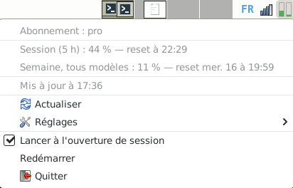

# usclaude

*[English version](README.md)*

Petite applet Linux qui affiche dans la zone de notification les limites d'usage de
[Claude Code](https://claude.com/claude-code), les mêmes que la commande `/usage` :
session de 5 heures et limites hebdomadaires, avec l'heure de remise à zéro.



L'icône montre deux jauges, **session** à gauche et **semaine** à droite, vertes sous
50 %, orange sous 80 %, rouges au-delà. Le détail s'affiche au survol et dans le menu.

Écrit en Rust avec [ksni](https://github.com/iovxw/ksni) (protocole
StatusNotifierItem, sans GTK). Un seul binaire statique, sans aucune dépendance.

> Projet indépendant, non affilié à Anthropic.

## Prérequis

- **Claude Code connecté avec un compte claude.ai** (Pro ou Max), c'est-à-dire via
  `/login`. Une clé d'API n'a pas de limites `/usage` à afficher.
- **Un panneau compatible StatusNotifierItem**, le protocole standard des icônes de
  notification. X11 ou Wayland ne change rien.

## Compatibilité

| Bureau | Prise en charge |
| --- | --- |
| KDE Plasma | ✅ native |
| XFCE 4.16 et plus récent | ✅ greffon *Zone de notification* (testé sur XFCE 4.20) |
| LXQt, Cinnamon | ✅ native |
| GNOME sous Ubuntu | ✅ extension AppIndicator installée d'office |
| GNOME ailleurs (Debian, Fedora…) | ⚠️ installer l'extension *AppIndicator and KStatusNotifierItem Support* |
| MATE, Budgie | ⚠️ selon la version et l'applet de notification utilisée |
| Sway, Hyprland… avec waybar | ✅ si le module `tray` est activé |
| i3bar, polybar, LXDE | ❌ ne gèrent que l'ancien protocole XEmbed |

Seul XFCE 4.20 a été testé ; le reste s'appuie sur la prise en charge annoncée par
chaque bureau.

Sans zone de notification compatible, l'applet ne s'arrête pas : elle l'indique dans
le terminal et patiente. L'icône apparaît dès que le panneau est prêt, ce qui couvre
aussi le démarrage de session, quand l'applet se lance avant le panneau, et le
redémarrage du panneau.

## Installation

Depuis la [dernière version publiée](https://github.com/niqoz/usclaude/releases/latest).

**Debian, Ubuntu, Linux Mint** :

```sh
sudo apt install ./usclaude_0.2.1_amd64.deb
```

L'applet s'ajoute au menu, dans **Accessoires**, et se lance aussi en tapant
`usclaude`.

**Autres distributions** (x86_64) : binaire statique, sans aucune dépendance.

```sh
tar xzf usclaude-0.2.1-x86_64-linux.tar.gz
install -m 755 usclaude-0.2.1-x86_64-linux/usclaude ~/.local/bin/
usclaude &
```

**Depuis les sources** (Rust 1.89 ou plus récent) :

```sh
cargo install --git https://github.com/niqoz/usclaude
```

Pour qu'elle démarre avec la session, cocher **Lancer à l'ouverture de session**
dans son menu.

## Menu

| Entrée | Rôle |
| --- | --- |
| Limites | Pourcentage utilisé et heure de remise à zéro de chaque limite. |
| Actualiser | Nouvelle mesure immédiate. |
| Réglages | Intervalle de rafraîchissement : 90 s, 3 min, 5 min ou 10 min. |
| Lancer à l'ouverture de session | Crée ou supprime l'entrée de démarrage automatique. |
| Redémarrer | Relance l'applet, par exemple après une mise à jour du binaire. |
| Quitter | Arrête l'applet. |

Une seule instance tourne à la fois : un second lancement s'arrête aussitôt.

## Fonctionnement

L'applet interroge le même service que `/usage`
(`https://api.anthropic.com/api/oauth/usage`) avec le jeton de connexion de Claude
Code, lu dans `~/.claude/.credentials.json` (ou `$CLAUDE_CONFIG_DIR`).

Ce jeton est **lu, jamais modifié** : l'applet ne le rafraîchit pas elle-même, car
cela invaliderait la session de Claude Code. Quand il expire, l'applet affiche
« jeton expiré » jusqu'à la prochaine utilisation de `claude`, qui le renouvelle.
Aucune autre donnée n'est envoyée ni conservée.

Fichiers utilisés :

| Fichier | Usage |
| --- | --- |
| `~/.claude/.credentials.json` | Jeton de connexion, en lecture seule. |
| `~/.config/usclaude/interval` | Intervalle choisi, en secondes. |
| `~/.cache/usclaude/last.json` | Dernière réponse valide, réaffichée au démarrage. |
| `~/.config/autostart/usclaude.desktop` | Démarrage automatique, si activé. |
| `$XDG_RUNTIME_DIR/usclaude-$USER.lock` | Verrou d'instance unique. |

## Codex

```sh
usclaude --codex &
```

affiche une deuxième icône, au contour bleu, pour les limites de
[Codex](https://github.com/openai/codex) d'un compte ChatGPT (session de 5 heures
et semaine), les mêmes que la commande `/status` de Codex. Contrairement aux
fichiers de session de Codex, les chiffres couvrent toute l'utilisation du compte,
quelle que soit la machine.

Le jeton est lu, jamais modifié, dans `~/.codex/auth.json` (ou `$CODEX_HOME`) ; le
service interrogé est `https://chatgpt.com/backend-api/wham/usage`, lui aussi non
documenté. Cette instance a ses propres réglages, cache, verrou et démarrage
automatique, sous le nom `usclaude-codex`. `usclaude --codex --print` fonctionne
aussi.

## Diagnostic

```sh
usclaude --print
```

affiche l'usage une fois dans le terminal, ou l'erreur rencontrée.

## Limites connues

- **Service non documenté** : l'adresse et le format de la réponse ne sont pas
  publics et peuvent changer sans préavis. Les limites inconnues sont affichées sous
  leur nom brut dès qu'elles dépassent 0 %.
- **Rafraîchissement fréquent** : le service peut répondre « trop de requêtes »
  (erreur 429). L'applet garde alors les dernières valeurs et attend le délai
  indiqué par le service (en-tête `Retry-After`, jusqu'à 1 h). S'il n'en indique
  pas, elle double son attente à chaque refus, jusqu'à 10 min. Elle revient à
  l'intervalle choisi dès qu'une réponse passe ; le menu indique l'heure du
  prochain essai.
- **Au démarrage**, l'applet réaffiche aussitôt les derniers chiffres connus, avec
  leur heure (« Mis à jour mer. 9 à 15:11 »), le temps que la première mesure
  aboutisse. Une erreur survenue depuis s'affiche sur sa propre ligne du menu.
- **Langue** : français si la langue du système l'est (`LANG=fr_…`), anglais sinon.
  Pour forcer l'anglais : `LANG=en_US.UTF-8 usclaude`.

## Tests

```sh
cargo test
cargo clippy --all-targets
```

## Fichiers de release

```sh
./packaging/build-release.sh
```

produit dans `target/dist/` l'archive `.tar.gz` et le paquet `.deb`, tous deux avec
un binaire statique (musl). Prérequis : la cible
`rustup target add x86_64-unknown-linux-musl`, et les paquets `musl-tools`,
`dpkg-dev` et `fakeroot`.
